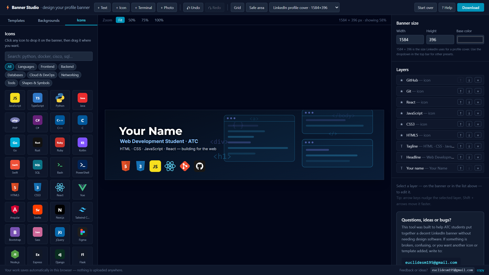

# Banner Studio

**▶ Use it here: <https://banner-studio.rafaelmarin.dev>** — no install, no sign-up.
Mirror: <https://marinm80.github.io/banner-studio/>

A free, browser-based editor for LinkedIn profile banners. Built for ATC students who are
starting out in Information Technology and want a decent-looking cover image without learning
Photoshop, creating an account, or paying for anything.

Everything runs in the browser. Nothing is uploaded, no account is needed, and your work saves
itself in your own browser between visits.



## What you can do

- **Start from a template.** One per ATC discipline — Web Development, Cloud Computing, Network
  Support Services, Database Application Development — plus general-purpose designs for anyone.
- **Change absolutely everything.** Text, fonts, sizes, colors, shadows, position, rotation,
  opacity, layer order, banner dimensions and background are all editable.
- **Add technology icons.** Around 90 built in — JavaScript, Python, Linux, Git, Docker, AWS,
  Cisco, MySQL, and many more — searchable by name or keyword.
- **Add your own icons.** Upload an SVG/PNG/JPG or paste SVG code; your icons are saved in your
  browser and show up in the picker alongside the built-in ones.
- **Use real photographs.** A curated set of free Unsplash photos — networking, cloud, code and
  data centers — plus a dimming slider so your name stays readable on top. You can also upload
  your own picture or paste any image link.
- **Drop in an editable terminal window.** Every command line is yours to rewrite.
- **Export.** JPEG or PNG at exact pixel size, rendered on a canvas so the download matches the
  preview.

## Banner sizes

| Preset | Size |
| --- | --- |
| LinkedIn profile cover (default) | 1584 × 396 |
| LinkedIn company cover | 1128 × 191 |
| Wide banner | 1500 × 500 |
| X / Twitter header | 1500 × 500 |
| GitHub social preview | 1280 × 640 |

Any custom width and height also works — set it in the **Banner size** panel on the right.

Turn on **Safe area** in the top bar to see the region LinkedIn keeps visible on every device,
along with the spot where your profile photo covers the banner.

## Running it locally

Requires [Node.js](https://nodejs.org) 18 or newer.

```bash
npm install
```

```bash
npm run dev
```

Then open the URL the terminal prints (by default <http://localhost:5299>).

To build a static version you can host anywhere:

```bash
npm run build
```

The result lands in `dist/` and works on GitHub Pages, Netlify, Vercel or any static host.

### With Docker

The repository ships a multi-stage `Dockerfile` that builds the site and serves it with nginx:

```bash
docker build -t banner-studio . && docker run -p 8080:80 banner-studio
```

On Coolify (or any host that builds from a repository), choose the **Dockerfile** build pack —
the *Static* build pack copies the repository without compiling it, which serves the raw source
and renders a blank page.

## How it is put together

| Path | What lives there |
| --- | --- |
| `src/components/` | UI: toolbar, canvas, panels, layer components, modals |
| `src/features/editor/` | Redux slice holding the banner: canvas, background, layers, undo history |
| `src/features/backgrounds/` | Background catalog served through an API-shaped async function |
| `src/features/icons/` | User-added icons |
| `src/data/icons.js` | The built-in icon library (inline SVG, 64 × 64) |
| `src/data/templates.js` | Starter templates, including the ATC ones |
| `src/utils/canvasUtils.js` | Canvas renderer — the single source of truth for the export |

Stack: React 18, Redux Toolkit, Vite and Tailwind CSS v4.

### Backgrounds

Pattern backgrounds are generated as SVG at runtime by
`src/features/backgrounds/backgroundsAPI.js`, using a seeded random generator so the catalog is
identical every time. Photographs are hotlinked from the Unsplash CDN by id in the same file.
Everything is served through `fetchBackgrounds({ theme, page, limit })`, which has the same shape
as a paginated REST endpoint — swapping in a different provider means replacing that one function.

Photos are used under the [Unsplash License](https://unsplash.com/license) and every photographer
is credited under their thumbnail in the picker.

### Adding a new icon to the built-in library

Add an entry to `ICONS` in `src/data/icons.js`. `svg` is the inner markup of a 64 × 64 viewBox:

```js
{ id: 'svelte', name: 'Svelte', category: 'Frontend', keywords: 'compiler spa', svg: mono('#ff3e00', 'Sv') }
```

Set `mono: true` and draw with `currentColor` if the icon should be recolorable by the user.

### Adding a new template

Add an entry to `TEMPLATES` in `src/data/templates.js` with a `backgroundId` from the catalog and a
`build()` returning the layers.

## Contact

Questions, ideas, bugs, or a request for another icon or template:

**euclidesm195@gmail.com**
